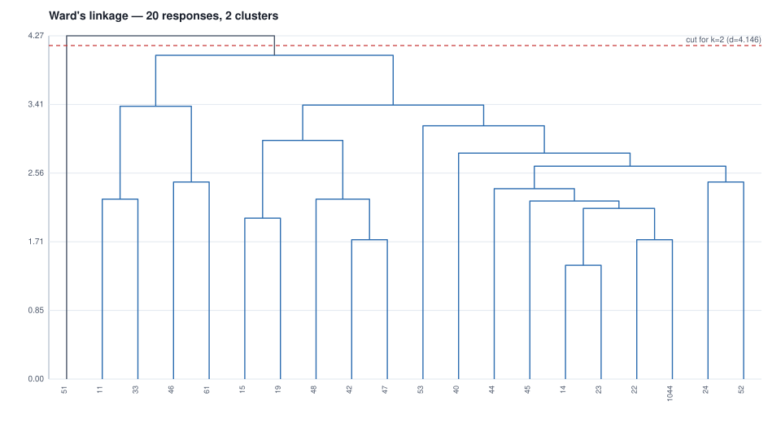

# 04 - Ward's hierarchical cluster analysis over his coding

20 responses x 29 codes after the low-frequency filter
(minimum 2 responses per code: 29 kept, 47 dropped).
Cluster count from the agglomeration schedule: `n_clusters = n_samples - break_stage (Essary 2022, via Chan 2025)` -> largest break at stage
18 of 19 (delta 0.618) -> **2 clusters**, cut at distance 4.146.

| cluster | n | share | members (response ids) |
|---:|---:|---:|---|
| 1 | 19 | 95% | 11, 14, 15, 19, 22, 23, 24, 33, 40, 42, 44, 45, 46, 47, 48, 52, 53, 61, 1044 |
| 2 | 1 | 5% | 51 |

## Cluster 1 - code means (top 10; prominent at >= 0.4)

| code | mean | responses | prominent |
|---|---:|---:|---|
| `ease-work` | 0.474 | 9 | yes |
| `efficiency` | 0.368 | 7 | no |
| `ease-life` | 0.263 | 5 | no |
| `ease-travel` | 0.211 | 4 | no |
| `applications-meetings` | 0.158 | 3 | no |
| `future-inevitability` | 0.158 | 3 | no |
| `future-positive` | 0.158 | 3 | no |
| `negative_impacts-dependency` | 0.158 | 3 | no |
| `positive_impacts-general` | 0.158 | 3 | no |
| `progress-holistic` | 0.158 | 3 | no |

## Cluster 2 - code means (top 10; prominent at >= 0.4)

| code | mean | responses | prominent |
|---|---:|---:|---|
| `adoption-high` | 1.000 | 1 | yes |
| `applications-robotics` | 1.000 | 1 | yes |
| `applications-self-driving_cars` | 1.000 | 1 | yes |
| `ease-life` | 1.000 | 1 | yes |
| `future-inevitability` | 1.000 | 1 | yes |
| `future-transformation` | 1.000 | 1 | yes |
| `impact-jobs` | 1.000 | 1 | yes |
| `improvement-accuracy` | 1.000 | 1 | yes |
| `jobs-computer_operator` | 1.000 | 1 | yes |
| `negative_impacts-job_destruction` | 1.000 | 1 | yes |

## Agglomeration schedule

| stage | distance | delta | size |
|---:|---:|---:|---:|
| 1 | 1.414 | 0.000 | 2 |
| 2 | 1.732 | 0.318 | 2 |
| 3 | 1.732 | 0.000 | 2 |
| 4 | 2.000 | 0.268 | 2 |
| 5 | 2.121 | 0.121 | 4 |
| 6 | 2.214 | 0.092 | 5 |
| 7 | 2.236 | 0.022 | 2 |
| 8 | 2.236 | 0.000 | 3 |
| 9 | 2.366 | 0.130 | 6 |
| 10 | 2.449 | 0.083 | 2 |
| 11 | 2.449 | 0.000 | 2 |
| 12 | 2.646 | 0.196 | 8 |
| 13 | 2.809 | 0.163 | 9 |
| 14 | 2.966 | 0.158 | 5 |
| 15 | 3.148 | 0.182 | 10 |
| 16 | 3.391 | 0.243 | 4 |
| 17 | 3.406 | 0.015 | 15 |
| 18 | 4.024 | 0.618 | 19 |
| 19 | 4.267 | 0.242 | 20 |

## Codes dropped by the frequency filter (47)

`AI-machine_communication`, `AI-tool`, `adoption-necessity`, `adoption-present`, `applications-decision-making`, `applications-friend`, `applications-information`, `applications-medical_care`, `applications-navigation`, `applications-personal_assistant`, `applications-planning`, `applications-relationships`, `applications-search`, `applications-text_generation`, `applications-translation`, `impact-global`, `improvement-personalisation`, `improvement-quality_of_life`, `improvement-speed`, `jobs-businessman`, `jobs-nurse`, `jobs-surveillance`, `jobs-tutor`, `key-sectors-elder_care`, `key_sectors-defence`, `key_sectors-disaster_management`, `key_sectors-education`, `key_sectors-entertainment`, `key_sectors-health`, `key_sectors-marketing`, `key_sectors-technology`, `key_sectors-transport`, `negative_impacts-deskilling`, `negative_impacts-enslavement`, `positive_impacts-autonomy`, `positive_impacts-corruption_reduction`, `positive_impacts-cost_reduction`, `positive_impacts-greater_enjoyment`, `positive_impacts-jobs`, `positive_impacts-productivity`, `progress-economy`, `requirements-basic_income`, `requirements-regulation`, `safety-cybersecurity`, `safety-home`, `safety-travel`, `safety-women`
