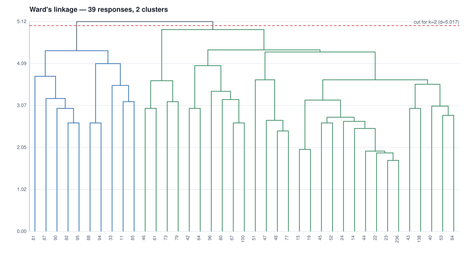

# 04 - Ward's hierarchical cluster analysis over his coding

39 responses x 68 codes after the low-frequency filter
(minimum 2 responses per code: 68 kept, 41 dropped).
Cluster count from the agglomeration schedule: `n_clusters = n_samples - break_stage (Essary 2022, via Chan 2025)` -> largest break at stage
37 of 38 (delta 0.494) -> **2 clusters**, cut at distance 5.017.

| cluster | n | share | members (response ids) |
|---:|---:|---:|---|
| 1 | 10 | 26% | 11, 33, 81, 82, 85, 87, 88, 90, 94, 95 |
| 2 | 29 | 74% | 14, 15, 19, 22, 23, 24, 40, 42, 43, 44, 45, 46, 47, 48, 51, 52, 53, 61, 64, 67, 73, 77, 79, 80, 84, 96, 100, 138, 236 |

## The row universe, and why it is the coded set

The matrix above has **39 rows: the responses his export actually
codes**, not one row per response in the corpus. Clustering the whole corpus would put
every uncoded response in as an identical all-zero row, and Ward's linkage would then
be describing the uncoded majority rather than the coding. Both readings are
legitimate and they answer different questions; this one answers "what structure is in
his coding".

Measured, on the same coding, over the whole corpus instead:

| row universe | rows | codes after the filter | clusters | cluster sizes |
|---|---:|---:|---:|---|
| the coded set (used here) | 39 | 68 | 2 | 10, 29 |
| every response in the corpus | 200 | 68 | 1 | 200 |

> **What the whole-corpus reading says about itself.** the largest break is at stage 199 of 199, so the Essary rule gives 1 cluster(s); the data does not support a cluster structure at this sample size — set AnalysisConfig.n_clusters explicitly if a partition is wanted anyway.

## Cluster 1 - code means (top 10; prominent at >= 0.4)

| code | mean | responses | prominent |
|---|---:|---:|---|
| `positive_impacts-problem-solving` | 0.800 | 8 | yes |
| `efficiency` | 0.400 | 4 | yes |
| `future-transformation` | 0.400 | 4 | yes |
| `applications-decision-making` | 0.300 | 3 | no |
| `applications-search` | 0.300 | 3 | no |
| `ease-work` | 0.300 | 3 | no |
| `future-positive` | 0.300 | 3 | no |
| `positive_impacts-general` | 0.300 | 3 | no |
| `positive_impacts-personalisation` | 0.300 | 3 | no |
| `applications-chatbots` | 0.200 | 2 | no |

## Cluster 2 - code means (top 10; prominent at >= 0.4)

| code | mean | responses | prominent |
|---|---:|---:|---|
| `ease-life` | 0.241 | 7 | no |
| `ease-work` | 0.241 | 7 | no |
| `future-inevitability` | 0.241 | 7 | no |
| `efficiency` | 0.207 | 6 | no |
| `negative_impacts-dependency` | 0.207 | 6 | no |
| `negative_impacts-job_destruction` | 0.207 | 6 | no |
| `adoption-high` | 0.172 | 5 | no |
| `future-positive` | 0.172 | 5 | no |
| `positive_impacts-general` | 0.172 | 5 | no |
| `ease-travel` | 0.138 | 4 | no |

## Agglomeration schedule

| stage | distance | delta | size |
|---:|---:|---:|---:|
| 1 | 1.732 | 0.000 | 2 |
| 2 | 1.915 | 0.183 | 3 |
| 3 | 1.958 | 0.043 | 4 |
| 4 | 2.000 | 0.042 | 2 |
| 5 | 2.449 | 0.449 | 2 |
| 6 | 2.510 | 0.060 | 5 |
| 7 | 2.646 | 0.136 | 2 |
| 8 | 2.646 | 0.000 | 2 |
| 9 | 2.646 | 0.000 | 2 |
| 10 | 2.646 | 0.000 | 2 |
| 11 | 2.683 | 0.038 | 6 |
| 12 | 2.708 | 0.025 | 3 |
| 13 | 2.784 | 0.076 | 8 |
| 14 | 2.828 | 0.045 | 2 |
| 15 | 3.000 | 0.172 | 2 |
| 16 | 3.000 | 0.000 | 2 |
| 17 | 3.000 | 0.000 | 3 |
| 18 | 3.000 | 0.000 | 2 |
| 19 | 3.055 | 0.055 | 3 |
| 20 | 3.162 | 0.107 | 2 |
| 21 | 3.162 | 0.000 | 2 |
| 22 | 3.202 | 0.039 | 10 |
| 23 | 3.215 | 0.013 | 3 |
| 24 | 3.240 | 0.026 | 4 |
| 25 | 3.416 | 0.175 | 4 |
| 26 | 3.559 | 0.143 | 3 |
| 27 | 3.587 | 0.028 | 5 |
| 28 | 3.674 | 0.087 | 4 |
| 29 | 3.697 | 0.023 | 4 |
| 30 | 3.697 | 0.000 | 15 |
| 31 | 3.782 | 0.085 | 5 |
| 32 | 4.041 | 0.260 | 6 |
| 33 | 4.091 | 0.049 | 5 |
| 34 | 4.374 | 0.284 | 19 |
| 35 | 4.405 | 0.030 | 10 |
| 36 | 4.426 | 0.021 | 25 |
| 37 | 4.919 | 0.494 | 29 |
| 38 | 5.115 | 0.196 | 39 |

## Codes dropped by the frequency filter (41)

`AI-omnipotence`, `AI-self-modification`, `AI-superintelligence`, `AI-surveillance`, `AI-tool`, `applications-deep_fakes`, `applications-financial_assistance`, `applications-medical_care`, `applications-navigation`, `applications-planning`, `applications-relationships`, `applications-research`, `applications-simulation`, `applications-text_generation`, `applications-translation`, `applications-voice_recognition`, `impact-climate_change`, `impact-misconception`, `improvement-teaching_learning`, `jobs-businessman`, `jobs-nurse`, `jobs-surveillance`, `key_sectors-defence`, `key_sectors-disaster_management`, `key_sectors-elder_care`, `key_sectors-entertainment`, `key_sectors-finance`, `key_sectors-marketing`, `negative_impacts-control`, `negative_impacts-lack_of_inclusion`, `positive_impacts-autonomy`, `positive_impacts-corruption_reduction`, `positive_impacts-drug_discovery`, `positive_impacts-greater_enjoyment`, `positive_impacts-upskilling`, `progress-economy`, `requirements-basic_income`, `safety-home`, `safety-privacy`, `safety-travel`, `safety-women`
