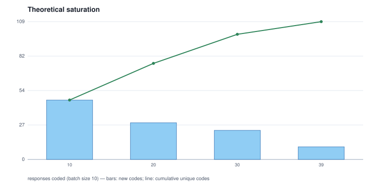

# 05 - Theoretical saturation over his coding

Batch size 10; 109 distinct codes in total; **not saturated**: every batch introduced new codes.

| batch | responses | cumulative responses | new codes | cumulative codes |
|---:|---:|---|---:|---:|
| 1 | 10 | 10 | 47 | 47 |
| 2 | 10 | 20 | 29 | 76 |
| 3 | 10 | 30 | 23 | 99 |
| 4 | 9 | 39 | 10 | 109 |

## Batch 1 - new codes (47)

`AI-machine_communication`, `AI-tool`, `adoption-necessity`, `applications-chatbots`, `applications-decision-making`, `applications-information`, `applications-meetings`, `applications-personal_assistant`, `applications-relationships`, `applications-self-driving_cars`, `ease-life`, `ease-travel`, `ease-work`, `efficiency`, `future-inevitability`, `impact-travel_immigration`, `improvement-accuracy`, `improvement-personalisation`, `improvement-speed`, `jobs-businessman`, `jobs-computer_operator`, `jobs-driver`, `jobs-surveillance`, `jobs-tutor`, `key_sectors-defence`, `key_sectors-disaster_management`, `key_sectors-education`, `key_sectors-marketing`, `key_sectors-technology`, `key_sectors-transport`, `negative_impacts-dependency`, `negative_impacts-laziness`, `negative_impacts-misuse`, `positive_impacts-cost_reduction`, `positive_impacts-general`, `positive_impacts-greater_enjoyment`, `positive_impacts-jobs`, `positive_impacts-problem-solving`, `positive_impacts-productivity`, `positive_impacts-stress_reduction`, `progress-economy`, `progress-holistic`, `progress-now`, `requirements-oversight`, `safety-cybersecurity`, `safety-travel`, `safety-women`

## Batch 2 - new codes (29)

`adoption-high`, `adoption-present`, `applications-friend`, `applications-medical_care`, `applications-navigation`, `applications-planning`, `applications-robotics`, `applications-search`, `applications-text_generation`, `applications-translation`, `future-positive`, `future-transformation`, `impact-global`, `impact-jobs`, `improvement-quality_of_life`, `jobs-nurse`, `key_sectors-elder_care`, `key_sectors-entertainment`, `key_sectors-health`, `negative_impacts-deskilling`, `negative_impacts-enslavement`, `negative_impacts-general`, `negative_impacts-job_destruction`, `positive_impacts-automation`, `positive_impacts-autonomy`, `positive_impacts-corruption_reduction`, `requirements-basic_income`, `requirements-regulation`, `safety-home`

## Batch 3 - new codes (23)

`AI-autonomy`, `AI-self-modification`, `AI-speed`, `AI-superintelligence`, `applications-deep_fakes`, `applications-problem-solving`, `applications-summarising`, `applications-voice_recognition`, `future-hazard_avoidance`, `future-negative`, `impact-climate_change`, `impact-context-specific`, `impact-misconception`, `improvement-future_readiness`, `improvement-teaching_learning`, `negative_impacts-control`, `negative_impacts-danger_to_humans`, `negative_impacts-domination`, `negative_impacts-immobility`, `negative_impacts-lack_of_inclusion`, `negative_impacts-lack_of_information`, `positive_impacts-personalisation`, `safety-privacy`

## Batch 4 - new codes (10)

`AI-omnipotence`, `AI-surveillance`, `applications-financial_assistance`, `applications-research`, `applications-simulation`, `key_sectors-finance`, `positive_impacts-drug_discovery`, `positive_impacts-health`, `positive_impacts-invention`, `positive_impacts-upskilling`
