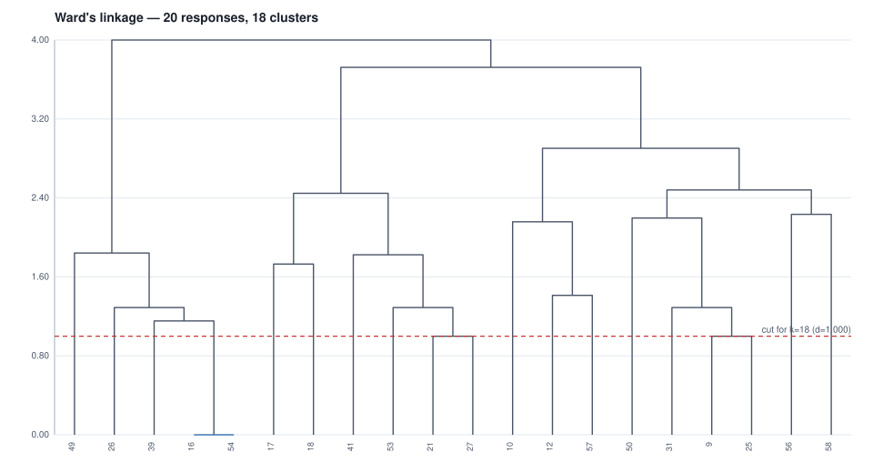

# 04 - Ward's hierarchical cluster analysis over the machine's coding

20 responses x 14 codes after the low-frequency filter
(minimum 2 responses per code: 14 kept, 4 dropped).
Cluster count from the agglomeration schedule: `n_clusters = n_samples - break_stage (Essary 2022, via Chan 2025)` -> largest break at stage
2 of 19 (delta 1.000) -> **18 clusters**, cut at distance 1.000.

| cluster | n | share | members (response ids) |
|---:|---:|---:|---|
| 1 | 2 | 10% | 16, 54 |
| 10 | 1 | 5% | 12 |
| 11 | 1 | 5% | 57 |
| 12 | 1 | 5% | 10 |
| 13 | 2 | 10% | 9, 25 |
| 14 | 1 | 5% | 31 |
| 15 | 1 | 5% | 50 |
| 16 | 1 | 5% | 56 |
| 17 | 1 | 5% | 58 |
| 2 | 1 | 5% | 39 |
| 3 | 1 | 5% | 26 |
| 4 | 1 | 5% | 49 |
| 5 | 1 | 5% | 17 |
| 6 | 1 | 5% | 18 |
| 7 | 2 | 10% | 21, 27 |
| 8 | 1 | 5% | 53 |
| 9 | 1 | 5% | 41 |

> **The analysis's own warning.** the largest break is at stage 2 of 19 — near the LEAF end of the tree — so the Essary rule gives 18 clusters for 20 responses, more than half of them. The rule assumes the largest break falls near the root; at this sample size it does not, and this count is degenerate rather than a finding. Take the count from a larger corpus, or set AnalysisConfig.n_clusters explicitly and report it as an override. Late breaks in this schedule: stage 18 (delta 0.8208) -> 2 clusters, stage 17 (delta 0.4227) -> 3 clusters

## Cluster 1 - code means (top 10; prominent at >= 0.4)

| code | mean | responses | prominent |
|---|---:|---:|---|
| `adoption-social_change` | 1.000 | 2 | yes |
| `applications-automation` | 1.000 | 2 | yes |
| `applications-education` | 1.000 | 2 | yes |
| `applications-healthcare` | 1.000 | 2 | yes |
| `future-imagined_scenario` | 1.000 | 2 | yes |
| `applications-data_driven_systems` | 0.000 | 0 | no |
| `applications-industry_and_transport` | 0.000 | 0 | no |
| `future-inevitability` | 0.000 | 0 | no |
| `future-uncertainty` | 0.000 | 0 | no |
| `governance-responsible_development` | 0.000 | 0 | no |

## Cluster 10 - code means (top 10; prominent at >= 0.4)

| code | mean | responses | prominent |
|---|---:|---:|---|
| `adoption-social_change` | 1.000 | 1 | yes |
| `applications-automation` | 1.000 | 1 | yes |
| `applications-data_driven_systems` | 1.000 | 1 | yes |
| `future-imagined_scenario` | 1.000 | 1 | yes |
| `negative_impacts-dependence` | 1.000 | 1 | yes |
| `positive_impacts-problem_solving` | 1.000 | 1 | yes |
| `applications-education` | 0.000 | 0 | no |
| `applications-healthcare` | 0.000 | 0 | no |
| `applications-industry_and_transport` | 0.000 | 0 | no |
| `future-inevitability` | 0.000 | 0 | no |

## Cluster 11 - code means (top 10; prominent at >= 0.4)

| code | mean | responses | prominent |
|---|---:|---:|---|
| `adoption-social_change` | 1.000 | 1 | yes |
| `applications-automation` | 1.000 | 1 | yes |
| `applications-data_driven_systems` | 1.000 | 1 | yes |
| `future-imagined_scenario` | 1.000 | 1 | yes |
| `future-inevitability` | 1.000 | 1 | yes |
| `positive_impacts-problem_solving` | 1.000 | 1 | yes |
| `applications-education` | 0.000 | 0 | no |
| `applications-healthcare` | 0.000 | 0 | no |
| `applications-industry_and_transport` | 0.000 | 0 | no |
| `future-uncertainty` | 0.000 | 0 | no |

## Cluster 12 - code means (top 10; prominent at >= 0.4)

| code | mean | responses | prominent |
|---|---:|---:|---|
| `adoption-social_change` | 1.000 | 1 | yes |
| `applications-automation` | 1.000 | 1 | yes |
| `applications-education` | 1.000 | 1 | yes |
| `future-imagined_scenario` | 1.000 | 1 | yes |
| `governance-responsible_development` | 1.000 | 1 | yes |
| `negative_impacts-dependence` | 1.000 | 1 | yes |
| `positive_impacts-problem_solving` | 1.000 | 1 | yes |
| `applications-data_driven_systems` | 0.000 | 0 | no |
| `applications-healthcare` | 0.000 | 0 | no |
| `applications-industry_and_transport` | 0.000 | 0 | no |

## Cluster 13 - code means (top 10; prominent at >= 0.4)

| code | mean | responses | prominent |
|---|---:|---:|---|
| `adoption-social_change` | 1.000 | 2 | yes |
| `future-imagined_scenario` | 1.000 | 2 | yes |
| `positive_impacts-problem_solving` | 1.000 | 2 | yes |
| `applications-data_driven_systems` | 0.500 | 1 | yes |
| `applications-automation` | 0.000 | 0 | no |
| `applications-education` | 0.000 | 0 | no |
| `applications-healthcare` | 0.000 | 0 | no |
| `applications-industry_and_transport` | 0.000 | 0 | no |
| `future-inevitability` | 0.000 | 0 | no |
| `future-uncertainty` | 0.000 | 0 | no |

## Cluster 14 - code means (top 10; prominent at >= 0.4)

| code | mean | responses | prominent |
|---|---:|---:|---|
| `adoption-social_change` | 1.000 | 1 | yes |
| `future-imagined_scenario` | 1.000 | 1 | yes |
| `applications-automation` | 0.000 | 0 | no |
| `applications-data_driven_systems` | 0.000 | 0 | no |
| `applications-education` | 0.000 | 0 | no |
| `applications-healthcare` | 0.000 | 0 | no |
| `applications-industry_and_transport` | 0.000 | 0 | no |
| `future-inevitability` | 0.000 | 0 | no |
| `future-uncertainty` | 0.000 | 0 | no |
| `governance-responsible_development` | 0.000 | 0 | no |

## Cluster 15 - code means (top 10; prominent at >= 0.4)

| code | mean | responses | prominent |
|---|---:|---:|---|
| `applications-healthcare` | 1.000 | 1 | yes |
| `future-imagined_scenario` | 1.000 | 1 | yes |
| `governance-responsible_development` | 1.000 | 1 | yes |
| `positive_impacts-problem_solving` | 1.000 | 1 | yes |
| `adoption-social_change` | 0.000 | 0 | no |
| `applications-automation` | 0.000 | 0 | no |
| `applications-data_driven_systems` | 0.000 | 0 | no |
| `applications-education` | 0.000 | 0 | no |
| `applications-industry_and_transport` | 0.000 | 0 | no |
| `future-inevitability` | 0.000 | 0 | no |

## Cluster 16 - code means (top 10; prominent at >= 0.4)

| code | mean | responses | prominent |
|---|---:|---:|---|
| `applications-automation` | 1.000 | 1 | yes |
| `future-imagined_scenario` | 1.000 | 1 | yes |
| `negative_impacts-job_loss` | 1.000 | 1 | yes |
| `adoption-social_change` | 0.000 | 0 | no |
| `applications-data_driven_systems` | 0.000 | 0 | no |
| `applications-education` | 0.000 | 0 | no |
| `applications-healthcare` | 0.000 | 0 | no |
| `applications-industry_and_transport` | 0.000 | 0 | no |
| `future-inevitability` | 0.000 | 0 | no |
| `future-uncertainty` | 0.000 | 0 | no |

## Cluster 17 - code means (top 10; prominent at >= 0.4)

| code | mean | responses | prominent |
|---|---:|---:|---|
| `applications-data_driven_systems` | 1.000 | 1 | yes |
| `applications-industry_and_transport` | 1.000 | 1 | yes |
| `future-imagined_scenario` | 1.000 | 1 | yes |
| `future-uncertainty` | 1.000 | 1 | yes |
| `adoption-social_change` | 0.000 | 0 | no |
| `applications-automation` | 0.000 | 0 | no |
| `applications-education` | 0.000 | 0 | no |
| `applications-healthcare` | 0.000 | 0 | no |
| `future-inevitability` | 0.000 | 0 | no |
| `governance-responsible_development` | 0.000 | 0 | no |

## Cluster 2 - code means (top 10; prominent at >= 0.4)

| code | mean | responses | prominent |
|---|---:|---:|---|
| `adoption-social_change` | 1.000 | 1 | yes |
| `applications-education` | 1.000 | 1 | yes |
| `applications-healthcare` | 1.000 | 1 | yes |
| `future-imagined_scenario` | 1.000 | 1 | yes |
| `applications-automation` | 0.000 | 0 | no |
| `applications-data_driven_systems` | 0.000 | 0 | no |
| `applications-industry_and_transport` | 0.000 | 0 | no |
| `future-inevitability` | 0.000 | 0 | no |
| `future-uncertainty` | 0.000 | 0 | no |
| `governance-responsible_development` | 0.000 | 0 | no |

## Cluster 3 - code means (top 10; prominent at >= 0.4)

| code | mean | responses | prominent |
|---|---:|---:|---|
| `adoption-social_change` | 1.000 | 1 | yes |
| `applications-automation` | 1.000 | 1 | yes |
| `applications-education` | 1.000 | 1 | yes |
| `applications-healthcare` | 1.000 | 1 | yes |
| `future-imagined_scenario` | 1.000 | 1 | yes |
| `negative_impacts-job_loss` | 1.000 | 1 | yes |
| `applications-data_driven_systems` | 0.000 | 0 | no |
| `applications-industry_and_transport` | 0.000 | 0 | no |
| `future-inevitability` | 0.000 | 0 | no |
| `future-uncertainty` | 0.000 | 0 | no |

## Cluster 4 - code means (top 10; prominent at >= 0.4)

| code | mean | responses | prominent |
|---|---:|---:|---|
| `adoption-social_change` | 1.000 | 1 | yes |
| `applications-automation` | 1.000 | 1 | yes |
| `applications-healthcare` | 1.000 | 1 | yes |
| `applications-industry_and_transport` | 1.000 | 1 | yes |
| `future-imagined_scenario` | 1.000 | 1 | yes |
| `applications-data_driven_systems` | 0.000 | 0 | no |
| `applications-education` | 0.000 | 0 | no |
| `future-inevitability` | 0.000 | 0 | no |
| `future-uncertainty` | 0.000 | 0 | no |
| `governance-responsible_development` | 0.000 | 0 | no |

## Cluster 5 - code means (top 10; prominent at >= 0.4)

| code | mean | responses | prominent |
|---|---:|---:|---|
| `adoption-social_change` | 1.000 | 1 | yes |
| `applications-healthcare` | 1.000 | 1 | yes |
| `applications-industry_and_transport` | 1.000 | 1 | yes |
| `future-imagined_scenario` | 1.000 | 1 | yes |
| `future-inevitability` | 1.000 | 1 | yes |
| `future-uncertainty` | 1.000 | 1 | yes |
| `negative_impacts-dependence` | 1.000 | 1 | yes |
| `applications-automation` | 0.000 | 0 | no |
| `applications-data_driven_systems` | 0.000 | 0 | no |
| `applications-education` | 0.000 | 0 | no |

## Cluster 6 - code means (top 10; prominent at >= 0.4)

| code | mean | responses | prominent |
|---|---:|---:|---|
| `adoption-social_change` | 1.000 | 1 | yes |
| `future-imagined_scenario` | 1.000 | 1 | yes |
| `future-inevitability` | 1.000 | 1 | yes |
| `future-uncertainty` | 1.000 | 1 | yes |
| `negative_impacts-dependence` | 1.000 | 1 | yes |
| `negative_impacts-inequality` | 1.000 | 1 | yes |
| `applications-automation` | 0.000 | 0 | no |
| `applications-data_driven_systems` | 0.000 | 0 | no |
| `applications-education` | 0.000 | 0 | no |
| `applications-healthcare` | 0.000 | 0 | no |

## Cluster 7 - code means (top 10; prominent at >= 0.4)

| code | mean | responses | prominent |
|---|---:|---:|---|
| `adoption-social_change` | 1.000 | 2 | yes |
| `future-imagined_scenario` | 1.000 | 2 | yes |
| `negative_impacts-dependence` | 1.000 | 2 | yes |
| `applications-industry_and_transport` | 0.500 | 1 | yes |
| `applications-automation` | 0.000 | 0 | no |
| `applications-data_driven_systems` | 0.000 | 0 | no |
| `applications-education` | 0.000 | 0 | no |
| `applications-healthcare` | 0.000 | 0 | no |
| `future-inevitability` | 0.000 | 0 | no |
| `future-uncertainty` | 0.000 | 0 | no |

## Cluster 8 - code means (top 10; prominent at >= 0.4)

| code | mean | responses | prominent |
|---|---:|---:|---|
| `adoption-social_change` | 1.000 | 1 | yes |
| `future-imagined_scenario` | 1.000 | 1 | yes |
| `negative_impacts-dependence` | 1.000 | 1 | yes |
| `negative_impacts-job_loss` | 1.000 | 1 | yes |
| `applications-automation` | 0.000 | 0 | no |
| `applications-data_driven_systems` | 0.000 | 0 | no |
| `applications-education` | 0.000 | 0 | no |
| `applications-healthcare` | 0.000 | 0 | no |
| `applications-industry_and_transport` | 0.000 | 0 | no |
| `future-inevitability` | 0.000 | 0 | no |

## Cluster 9 - code means (top 10; prominent at >= 0.4)

| code | mean | responses | prominent |
|---|---:|---:|---|
| `adoption-social_change` | 1.000 | 1 | yes |
| `applications-healthcare` | 1.000 | 1 | yes |
| `future-imagined_scenario` | 1.000 | 1 | yes |
| `negative_impacts-dependence` | 1.000 | 1 | yes |
| `negative_impacts-inequality` | 1.000 | 1 | yes |
| `applications-automation` | 0.000 | 0 | no |
| `applications-data_driven_systems` | 0.000 | 0 | no |
| `applications-education` | 0.000 | 0 | no |
| `applications-industry_and_transport` | 0.000 | 0 | no |
| `future-inevitability` | 0.000 | 0 | no |

## Agglomeration schedule

| stage | distance | delta | size |
|---:|---:|---:|---:|
| 1 | 0.000 | 0.000 | 2 |
| 2 | 1.000 | 1.000 | 2 |
| 3 | 1.000 | 0.000 | 2 |
| 4 | 1.155 | 0.155 | 3 |
| 5 | 1.291 | 0.136 | 3 |
| 6 | 1.291 | 0.000 | 3 |
| 7 | 1.291 | 0.000 | 4 |
| 8 | 1.414 | 0.123 | 2 |
| 9 | 1.732 | 0.318 | 2 |
| 10 | 1.826 | 0.094 | 4 |
| 11 | 1.844 | 0.018 | 5 |
| 12 | 2.160 | 0.316 | 3 |
| 13 | 2.198 | 0.038 | 4 |
| 14 | 2.236 | 0.038 | 2 |
| 15 | 2.449 | 0.213 | 6 |
| 16 | 2.483 | 0.034 | 6 |
| 17 | 2.906 | 0.423 | 9 |
| 18 | 3.727 | 0.821 | 15 |
| 19 | 4.004 | 0.277 | 20 |

## Codes dropped by the frequency filter (4)

`adoption-everyday_life`, `future-superintelligence`, `negative_impacts-unskilled_workers`, `positive_impacts-access`
