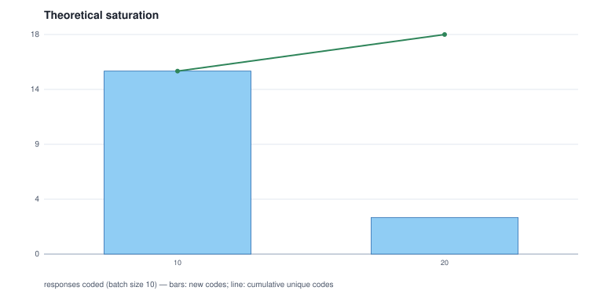

# 05 - Theoretical saturation over the machine's coding

Batch size 10; 18 distinct codes in total; **not saturated**: every batch introduced new codes.

| batch | responses | cumulative responses | new codes | cumulative codes |
|---:|---:|---|---:|---:|
| 1 | 10 | 10 | 15 | 15 |
| 2 | 10 | 20 | 3 | 18 |

## Batch 1 - new codes (15)

`adoption-social_change`, `applications-automation`, `applications-data_driven_systems`, `applications-education`, `applications-healthcare`, `applications-industry_and_transport`, `future-imagined_scenario`, `future-inevitability`, `future-uncertainty`, `governance-responsible_development`, `negative_impacts-dependence`, `negative_impacts-inequality`, `negative_impacts-job_loss`, `negative_impacts-unskilled_workers`, `positive_impacts-problem_solving`

## Batch 2 - new codes (3)

`adoption-everyday_life`, `future-superintelligence`, `positive_impacts-access`
